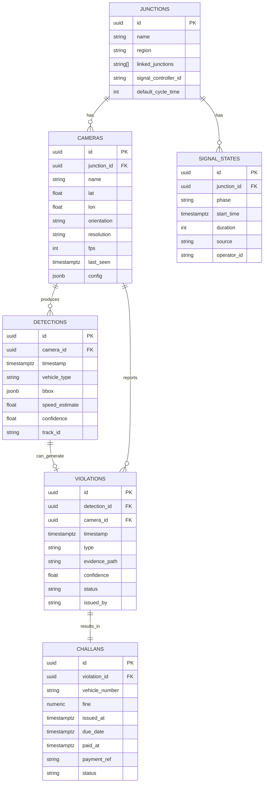

## Database ERD

```mermaid
erDiagram
  JUNCTIONS ||--o{ CAMERAS : has
  CAMERAS ||--o{ DETECTIONS : produces
  DETECTIONS ||--o| VIOLATIONS : can_generate
  CAMERAS ||--o{ VIOLATIONS : reports
  VIOLATIONS ||--|| CHALLANS : results_in
  JUNCTIONS ||--o{ SIGNAL_STATES : has

  JUNCTIONS {
    uuid id PK
    string name
    string region
    string[] linked_junctions
    string signal_controller_id
    int default_cycle_time
  }
  CAMERAS {
    uuid id PK
    uuid junction_id FK
    string name
    float lat
    float lon
    string orientation
    string resolution
    int fps
    timestamptz last_seen
    jsonb config
  }
  DETECTIONS {
    uuid id PK
    uuid camera_id FK
    timestamptz timestamp
    string vehicle_type
    jsonb bbox
    float speed_estimate
    float confidence
    string track_id
  }
  VIOLATIONS {
    uuid id PK
    uuid detection_id FK
    uuid camera_id FK
    timestamptz timestamp
    string type
    string evidence_path
    float confidence
    string status
    string issued_by
  }
  CHALLANS {
    uuid id PK
    uuid violation_id FK
    string vehicle_number
    numeric fine
    timestamptz issued_at
    timestamptz due_date
    timestamptz paid_at
    string payment_ref
    string status
  }
  SIGNAL_STATES {
    uuid id PK
    uuid junction_id FK
    string phase
    timestamptz start_time
    int duration
    string source
    string operator_id
  }
```

See `docs/db/retention.md` for retention and partitioning policy.
